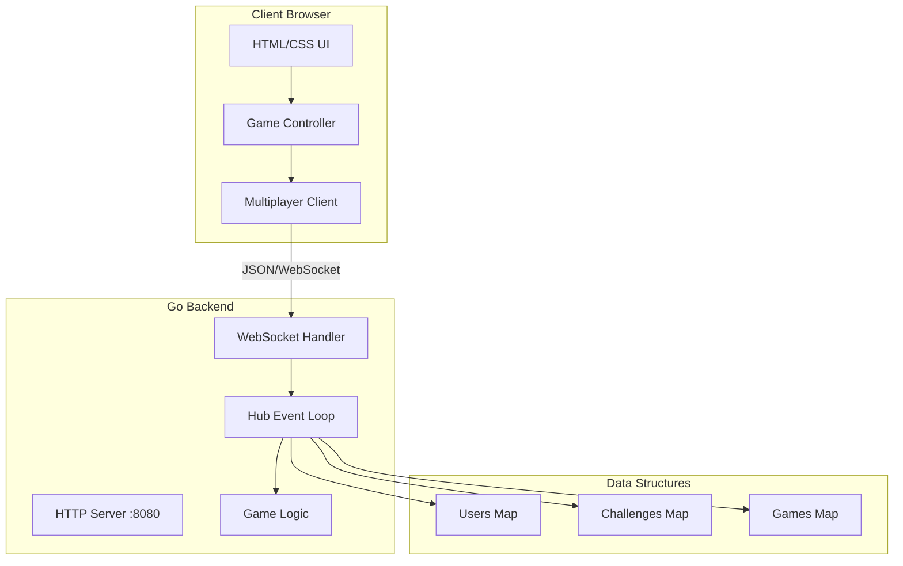
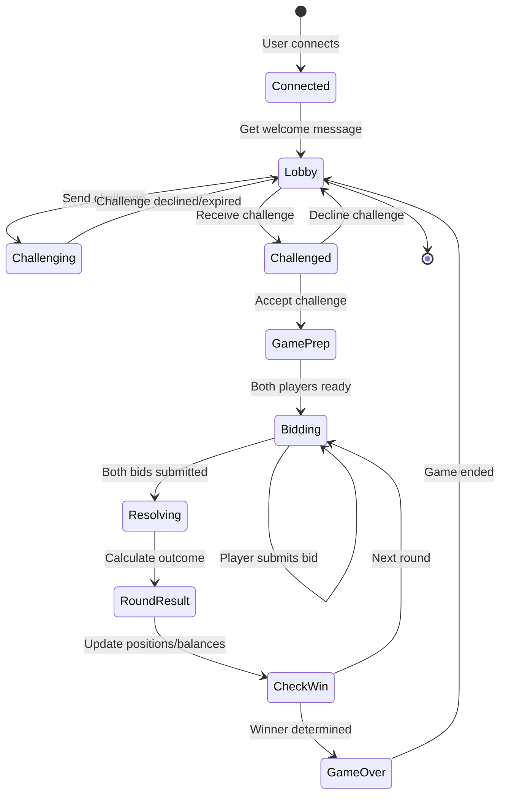
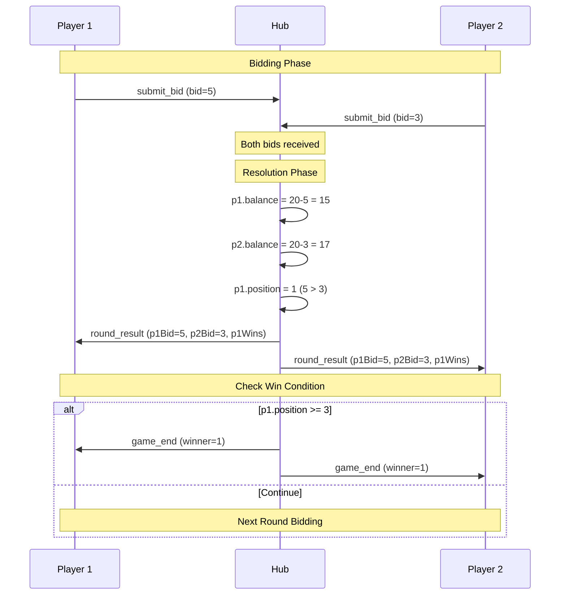
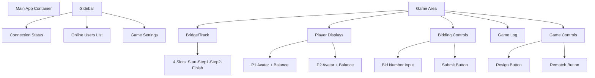
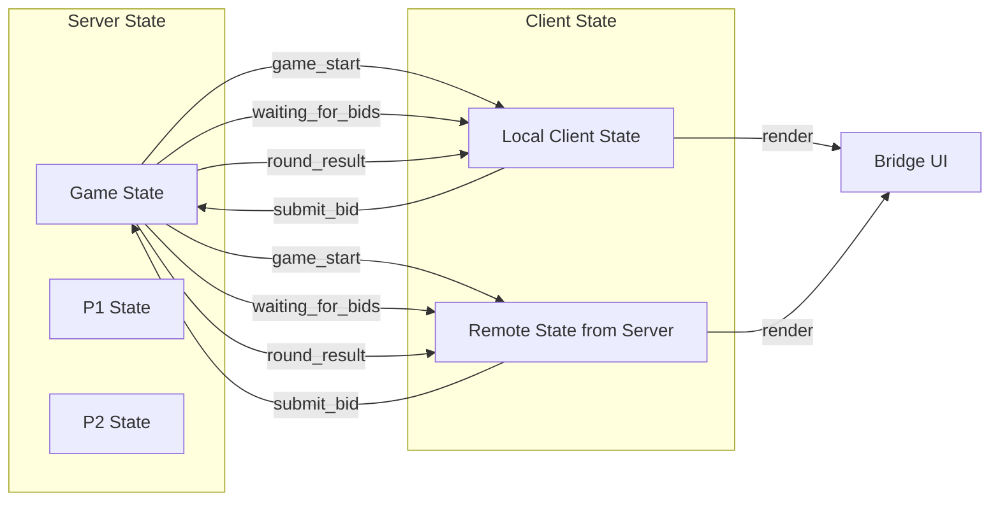
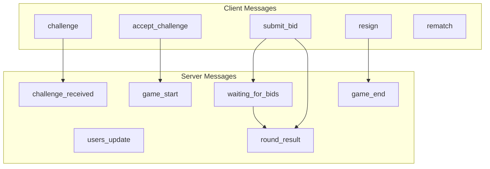

# Quo Vadis - Architecture Diagrams

## System Architecture



## Game State Machine



## Bidding & Resolution Flow



## Frontend Component Structure



## Data Flow During Game



## Message Flow Summary



## File Dependencies

```
backend/
├── main.go
│   └── imports: hub, client, names, storage
├── hub.go
│   └── imports: types, names
├── client.go
│   └── imports: hub, types
├── types.go
│   └── imports: encoding/json, time
└── names.go
    └── imports: math/rand, strings

Frontend/
├── index.html
│   └── loads: style.css, script.js, multiplayer.js
├── style.css
├── script.js
│   └── depends on: multiplayer.js
└── multiplayer.js
    └── depends on: script.js (game state)
```
